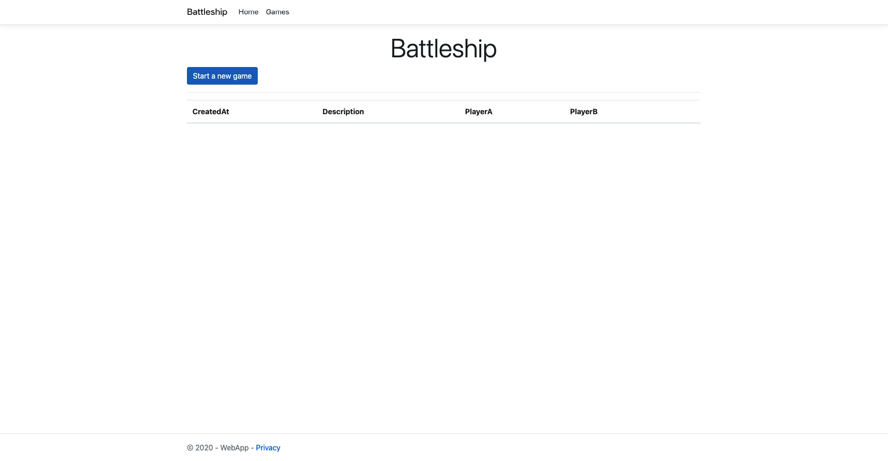
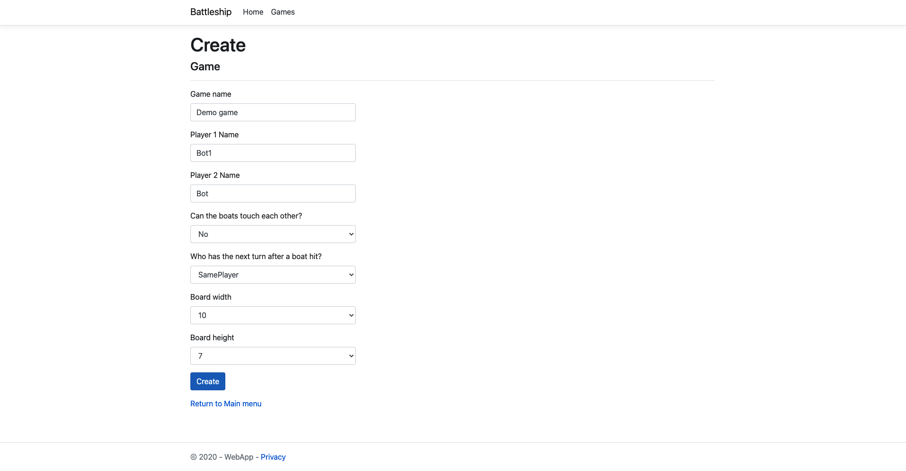
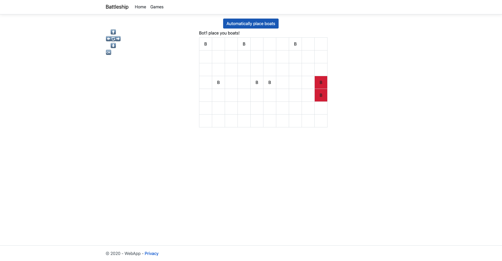
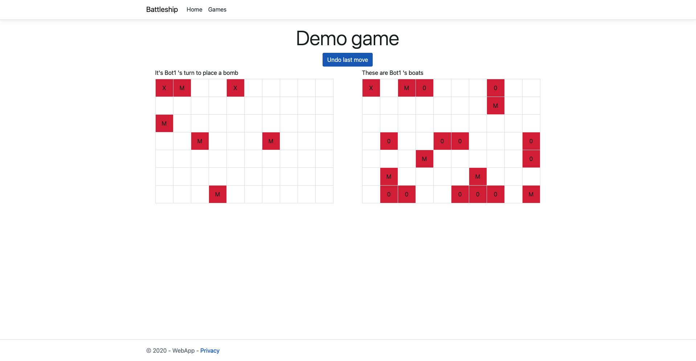
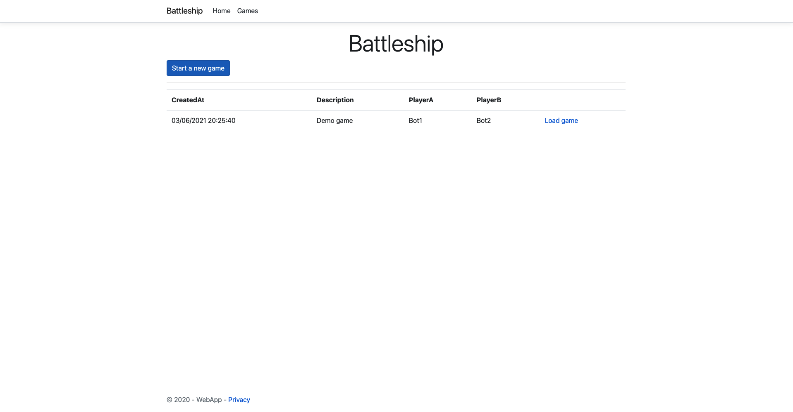

# BattleShip

**Database migrations**

~~~
dotnet ef migrations add InitialMigration --project DAL --startup-project ConsoleApp
dotnet ef database update  --project DAL --startup-project ConsoleApp
~~~

**Database droping**

~~~
dotnet ef database drop  --project DAL --startup-project ConsoleApp
~~~

## Project images

**Main Menu**

**Create a new Game**

**Player named "Bot1" placing his boats**

**Gameplay**

**Main Menu with games**

